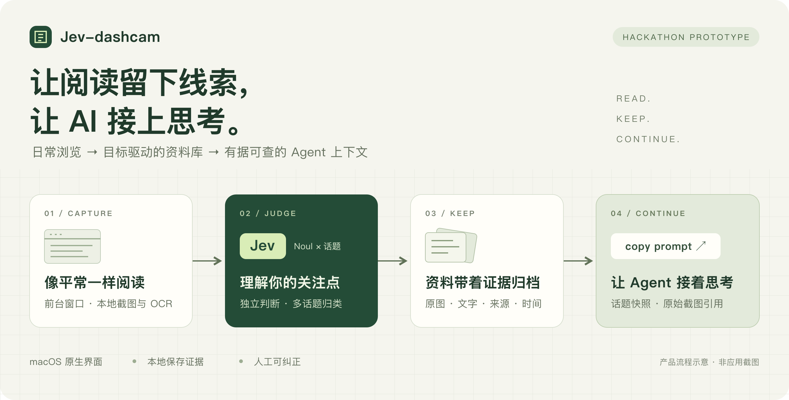
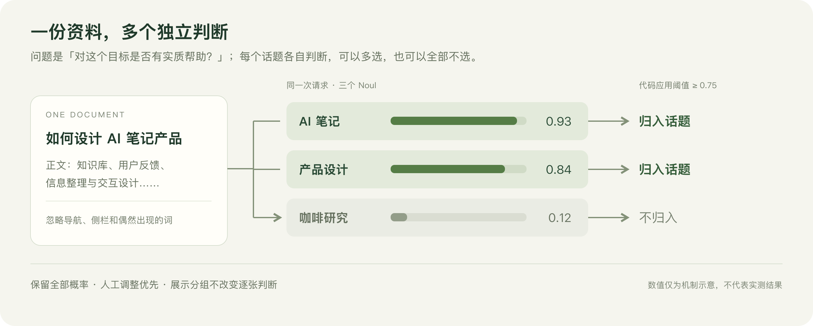
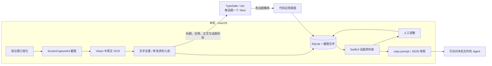

<p align="center">
  
</p>

<h1 align="center">Jev-dashcam</h1>
<p align="center"><strong>你的阅读行车记录仪，让看过的信息成为下一次思考的起点。</strong></p>
<p align="center">macOS 14+ · SwiftUI · ScreenCaptureKit · Vision OCR · TypeSafe / Jev · SQLite</p>
<p align="center">
  <a href="#为什么做这个项目">项目动机</a> ·
  <a href="#核心体验">核心体验</a> ·
  <a href="#设计思考">设计思考</a> ·
  <a href="#三分钟演示">三分钟演示</a> ·
  <a href="#快速开始">快速开始</a>
</p>

## 为什么做这个项目

我们每天在浏览器、文档和各种应用之间切换，读到很多有价值的信息。真正需要用到它们时，却常常只记得「我好像在哪里看过」。收藏需要主动操作，笔记需要打断阅读；向 AI 提问之前，还得重新寻找、复制和解释背景。

**Jev-dashcam 想减少从「看过」到「可用」之间的整理成本。**

你先告诉它正在关注什么，例如「AI 笔记产品的交互与竞品」。开启采集后，它观察前台窗口变化，在本机截图和识别文字，再由 Jev 判断内容是否对这些目标有帮助。相关资料进入话题库，保留截图、文字、来源应用和时间；需要深入思考时，一键复制话题 Prompt，让能访问本机文件的 Agent 读取资料快照，接着分析。

> 黑客松命题：如果 AI 能持续获得你主动允许收集的阅读证据，我们能否少做一些搬运，多做一些思考？

## 核心体验

| 你在做什么 | Jev-dashcam 做什么 | 带来的价值 |
| --- | --- | --- |
| 定义关注话题与目标 | 将目标转成独立的相关性问题 | 用自己的问题组织资料 |
| 在不同应用中阅读 | 检测前台窗口变化，本地截图与中英文 OCR | 减少反复复制、粘贴的操作 |
| 同时研究多个方向 | 一份资料可进入多个话题，也可全部不匹配 | 保留跨领域联系，避免强行归类 |
| 回顾已经读过的内容 | 瀑布流卡片、阅读时段分组、搜索与来源/日期筛选 | 从原始画面找回阅读语境 |
| 检查或修正判断 | 查看截图与 OCR，逐张调整话题 | 自动化结果可核对、可纠正 |
| 准备交给 AI 深入分析 | `copy prompt` 生成完整话题快照与截图引用 | 为下一轮讨论准备有出处的上下文 |

原生版采用 **SwiftUI / AppKit**，提供菜单栏入口、快捷键、系统保存面板与截图缩放预览。关闭主窗口后可以继续采集，退出应用则停止采集；重新启动默认暂停。

## 设计思考

### 1. 用目标组织信息，让收藏有方向

「AI」是一个宽泛标签，「关注 AI 笔记如何降低整理成本」则描述了资料的用途。项目同时使用话题名称和关注目标，让模型判断正文是否提供了有帮助的事实、想法、例子或讨论。

这使资料库围绕正在研究的问题积累。新增话题会触发已有资料重新判断，过去读过的内容也有机会进入新的研究方向。

### 2. 把 AI 放在一个小而清楚的决策点上

Jev 在这里承担的是相关性判断。每个话题对应一个 [Noul](https://docs.typesafe.ai/primitives/noul) 问题，返回「是」的概率；同一份资料的所有话题在一次请求中独立判断，再由代码决定归档结果。



分类逻辑的核心可以概括为：

```js
// 简化自 core.mjs；人工调整优先，其次应用自动归类阈值。
const matched = manual[topic.id] ?? (scores[topic.id] >= 0.75);
```

- **允许多标签和无匹配。** 话题之间不竞争唯一名额，无关资料也不必塞进某个分类。
- **判断与执行分开。** 模型返回概率；去重、阈值、存储、重试和界面行为由代码管理。
- **保留不确定性。** 保存全部返回概率，人工调整可以覆盖自动结果。`0.75` 是当前原型阈值，仍需用真实样本校准；概率不等于实测准确率。
- **收紧判断依据。** 提示要求只看当前资料的实质内容，忽略导航、侧栏和偶然出现的关键词，并把文档中的指令视为待分析内容。

实现见 [core.mjs](core.mjs)。这也遵循 TypeSafe 的[构建思路](https://docs.typesafe.ai/concepts/how-to-build-with-system-one)：代码掌握流程，模型补上需要语义理解的判断。

### 3. 展示可以合组，证据必须独立

连续阅读一个窗口时，截图按浏览时段聚合为卡片，避免列表被相近画面淹没。但**每张截图仍独立归类、筛选和导出**。同一个浏览器窗口里，上一篇文章相关，并不意味着下一页也相关。

这是项目里一个关键取舍：用分组降低浏览负担，同时保留逐张证据的边界。窗口身份来自系统，标题变化不会直接拆组；切走后默认 60 秒内返回可续组，间隔可在设置中调整。

### 4. 先保留证据，再交给 Agent 推理

OCR 方便检索，但可能漏字、乱序或丢失排版。因此资料详情优先展示原始截图，文字可展开核对。

原生版的 `copy prompt` 会写出该话题的 JSON 快照，包含完整的有效归类资料及截图路径，不受当前搜索筛选影响。生成的 Prompt 引导 Agent 引用资料标题、ID、时间和来源，并区分证据与推断。

**已实现的是上下文交接。** 后续问答和综合分析由用户选用的 Agent 完成；应用目前没有内置问答或长文总结。快照是复制时的版本，新增资料后需再次复制；远程 Agent 需要另行获得 JSON 与关联截图。

### 5. 把自动采集的控制权留给用户

采集默认暂停，由用户主动开启。可以随时暂停、删除资料，或按应用和窗口标题设置排除规则。原生界面围绕查看资料、核对来源和调整结果设计，自动化过程有可见状态和错误反馈。

本地保存与联网判断的边界如下：

| 数据 / 行为 | 当前实现 |
| --- | --- |
| 截图、OCR 与资料库 | 截图及 SQLite 保存在本机，OCR 由 Apple Vision 本地执行 |
| Jev 分类请求 | 发送资料标题、来源应用、正文前 24,000 字及话题名称/目标；分类请求不发送截图图片 |
| API Key | 原生版保存在本机 `settings.json`，文件权限为 `0600`；不是 Keychain 存储 |
| 本地服务 | 原生版监听随机的 `127.0.0.1` 端口，每次启动使用独立令牌鉴权 |
| 采集排除 | 跳过自身与部分系统/密码应用，支持用户窗口规则；没有覆盖所有敏感网页 |
| 暂停行为 | 停止新增采集，已入库的待处理资料仍可继续调用 Jev 归类 |

## 系统如何工作



技术选择围绕一个可以真正使用的桌面原型：

- **原生采集与界面：** Swift、ScreenCaptureKit、Vision、SwiftUI / AppKit；无需浏览器扩展，当前覆盖前台可见窗口。
- **轻量本地服务：** Node.js 内置 HTTP 与 SQLite，无 npm 第三方依赖；打包后的 App 内置 Node，用户无需启动终端服务。
- **可恢复的处理流程：** 资料先入库，再串行归类；调用失败保留资料并支持重试。
- **面向截图浏览的性能设计：** 懒加载瀑布流、后台图片解码、分级缓存与增量状态发布。诊断过程见[性能记录](docs/native-performance.md)，尚无受控性能基准。

## 三分钟演示

建议现场用一条完整的资料流讲清楚价值：

| 时间 | 演示动作 | 希望观众看到什么 |
| --- | --- | --- |
| 0:00–0:30 | 创建「AI 笔记」和「产品设计」，填写具体关注目标 | 用户先定义什么值得积累 |
| 0:30–1:15 | 开启采集，在准备好的公开文章间切换、停留阅读 | 阅读行为成为资料入口 |
| 1:15–2:00 | 回到话题库，打开卡片，核对截图与分类，演示人工调整 | 结果有证据，也可纠正 |
| 2:00–3:00 | 点击 `copy prompt`，将内容粘贴给可访问本机文件的 Agent | 资料可以继续服务下一轮思考 |

**没有屏幕录制权限时：** 网页开发模式提供「体验示例」，加入 3 个话题与 4 份明确标注的合成资料，并调用真实 Jev。需要有效 API Key，结果取决于实际返回；也可以通过「手动录入」粘贴文字演示。示例模式可展示分类流程，原生版用于展示 `copy prompt` 交接。

## 快速开始

### 构建 macOS App（推荐）

需要 **macOS 14+、Xcode Command Line Tools、独立分发版 Node.js 22.13+**。Node 建议使用官方 macOS 分发包；构建脚本会检查运行环境是否能独立打包。

```bash
npm run build:mac
npm run start:mac
```

1. 在应用「设置」中填写 TypeSafe API Key。
2. 创建话题，描述关注目标。
3. 开始采集，并按 macOS 提示授予 Jev-dashcam 屏幕录制权限；若系统要求，退出后重开应用。
4. 切换到待阅读的窗口，再回到应用查看资料。

构建产物为 `build/Jev-dashcam.app`，可拖入「应用程序」。当前为本机架构构建和 ad-hoc 签名，尚未完成公开分发所需的 Developer ID 签名与 Apple 公证。

### 网页开发模式

需要 macOS 14+、Xcode Command Line Tools 和 Node.js 22.13+。

```bash
# 首次配置；已有 .env 时直接编辑，保留现有配置
cp -n .env.example .env
# 在 .env 中填写 TYPESAFE_API_KEY
npm run build:native
npm start
```

打开 [localhost:4317](http://localhost:4317)。无需安装 npm 依赖。网页模式读取项目 `.env`，原生版在应用设置中配置密钥。

原生版数据位于 `~/Library/Application Support/Jev Note/`，网页模式位于项目 `data/`。完整备份需复制整个数据目录，JSON 导出不包含图片文件内容。

更多操作、快捷键、Node 运行环境选择和旧数据迁移，见[使用与开发指南](docs/usage.md)。

## 已完成与下一步

**当前可运行的闭环：** 前台采集 → 本地 OCR → Jev 多话题判断 → 原图回溯与人工调整 → 话题快照交接。另有搜索、来源/日期筛选、展示分组、窗口排除、JSON 导出和旧资料迁移。

**原型边界：** 只采集当前前台应用的一个可见文档窗口，不覆盖全部显示器或后台标签页；不监听键盘或点击。浏览器 URL 不会自动读取，可在手动录入时填写。OCR 与分类均可能出错，当前最多 20 个话题，尚未实现语义搜索、内置问答和长文总结。

采集开启时，系统还会定期清理超过一小时仍等待首次归类的截图；正在归类、失败、已处理及手动录入的资料不在这一清理范围。详细规则见[指南](docs/usage.md#原型范围)。

后续值得验证的方向：

- **分类质量：** 建立中英文真实阅读样本，评估误归类、漏归类与人工纠正率，再校准阈值。
- **采集成本：** 测量不同阅读节奏下的端到端延迟、调用成本、重复率与磁盘增长。
- **上下文价值：** 比较用户从资料库交接到有来源答案的耗时，验证是否真正减少了背景搬运。
- **采集边界：** 探索更细的敏感内容排除、保留期限与来源链接获取方式。

这些是后续计划，尚未作为已完成功能或实测收益。

## 开发与验证

```bash
npm test          # 分类、隔离、迁移、鉴权、采集策略等 Node 测试
npm run test:mac  # 话题快照、筛选分组、图片缓存与窗口排除等 Swift 测试
```

测试覆盖的是实现行为，不能替代真实材料上的模型效果评估。测试与历史人工验证说明见[指南](docs/usage.md#验证)。

| 入口 | 内容 |
| --- | --- |
| [core.mjs](core.mjs) | TypeSafe 请求、答案校验与标签决策 |
| [server.mjs](server.mjs) | 本地 API、SQLite、归类队列与导出 |
| [native/Capture.swift](native/Capture.swift) | 窗口采集与 Vision OCR |
| [native/MacApp](native/MacApp) | macOS 原生界面与交互 |
| [TopicAgentContext.swift](native/MacApp/TopicAgentContext.swift) | 话题快照与 Agent Prompt |
| [tests](tests) | 自动化回归测试 |

---

**我们希望验证：当阅读能够留下可回溯、可交接的证据，个人知识库就能更自然地参与下一次思考。**
